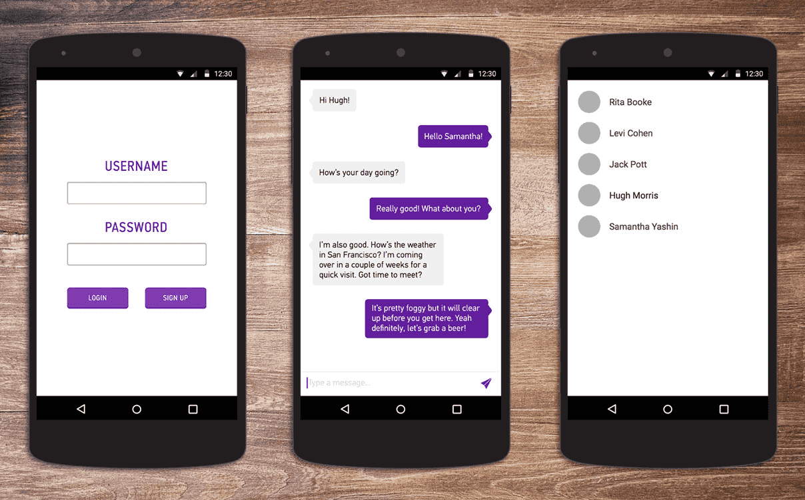
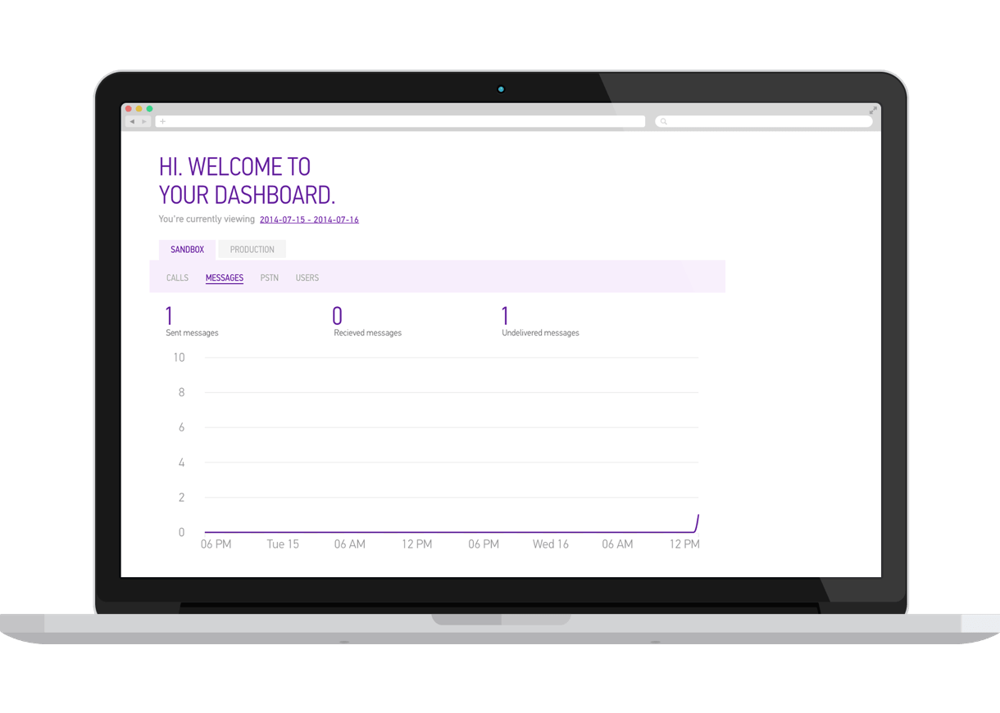

#Build an Android Instant Messaging App Using Sinch and Parse

This tutorial will teach you how to build an instant messaging app for Android using the Sinch Android SDK. By the end of this tutorial, your app will allow users to sign up, log in, see a list of all users and instant message any user. Your app will look similar to this:



The finished source code for this tutorial can be found [on our GitHub](https://github.com/sinch/android-messaging-tutorial).

##Setup

To get the ball rolling, I have created a skeleton project that you can clone from [this GitHub repository](https://github.com/sinch/android-messaging-tutorial-skeleton). This skeleton project includes: a basic login activity, a login layout, a messaging conversation layout and some graphics. Go ahead and import the project into Android Studio. Then run it to make sure everything compiles properly.

If you haven't already, set up developer accounts for [Sinch](https://www.sinch.com/dashboard/#/signup)(messaging SDK) and [Parse](http://www.parse.com/signup)(BaaS). For both [Sinch](http://www.sinch.com) and [Parse](http://www.parse.com), you will need to create an app in the developer portal. Hold on to the app keys and secrets that these services generate; you will need them in a few minutes.

[Get Started with Sinch](https://www.sinch.com/signup)

##User login with Parse

To begin, you will use Parse to authenticate your users. Follow the quickstart guide at [parse.com/apps/quickstart](https://parse.com/apps/quickstart#parse_data/mobile/android/native/existing) to set up the Parse Android SDK. If you are using Android Studio, be sure to right-click the .jar file and select "Add as library."

Parse requires internet and access to the network state. Add the following permissions in **AndroidManifest.xml**:

````
<uses-permission android:name="android.permission.INTERNET" />
<uses-permission android:name="android.permission.ACCESS_NETWORK_STATE" />
````
    
You must initialize Parse every time a user launches the app. Therefore, it makes sense to initialize Parse in the onCreate method of the application. Extend the application class and add the following in onCreate. Replace the placeholders with the application ID and client key you got from Parse.

````
public class MyApplication extends Application {
        @Override
        public void onCreate() {
            super.onCreate();
            Parse.initialize(this, "app-id", "client-key");
        }
    }
````
    
This is a good time to take a break and run your app. You won't see any visual differences, but you can check that your Parse keys work before moving on.

The layout for the login screen is already included in your skeleton project. Use the following Parse methods for login and signup in LoginActivity:

    loginButton = (Button) findViewById(R.id.loginButton);
    signUpButton = (Button) findViewById(R.id.signupButton);
    usernameField = (EditText) findViewById(R.id.loginUsername);
    passwordField = (EditText) findViewById(R.id.loginPassword);

    loginButton.setOnClickListener(new View.OnClickListener() {
        @Override
        public void onClick(View view) {
            username = usernameField.getText().toString();
            password = passwordField.getText().toString();

            ParseUser.logInInBackground(username, password, new LogInCallback() {
                public void done(ParseUser user, com.parse.ParseException e) {
                    if (user != null) {
                        //start next activity 
                        //start sinch service
                    } else {
                        Toast.makeText(getApplicationContext(),
                            "There was an error logging in.",
                                Toast.LENGTH_LONG).show();
                    }
                }
            });
        }
    });

    signUpButton.setOnClickListener(new View.OnClickListener() {
        @Override
        public void onClick(View view) {

            username = usernameField.getText().toString();
            password = passwordField.getText().toString();

            ParseUser user = new ParseUser();
            user.setUsername(username);
            user.setPassword(password);

            user.signUpInBackground(new SignUpCallback() {
                public void done(com.parse.ParseException e) {
                    if (e == null) {
                       //start next activity 
                       //start sinch service
                    } else {
                        Toast.makeText(getApplicationContext(),
                            "There was an error signing up."
                                , Toast.LENGTH_LONG).show();
                    }
                }
            });
        }
    });
    
When the login screen launches, you'll want to see if there are users already logged in. If there are, go directly to the next activity.

````
ParseUser currentUser = ParseUser.getCurrentUser();
if (currentUser != null) {
	//start next activity
	//start sinch service 
	}
````
    
Run your app to ensure everything is working so far. I suggest temporarily showing a toast message when the buttons are clicked so you know that they are functioning properly.
    
##Show a list of all users
    
When a user logs in, you'll want to launch an activity that shows a list of all users. Create this activity and call it **ListUsersActivity**. The layout should be a ListView:


	<LinearLayout xmlns:android="http://schemas.android.com/apk/res/android"
	    xmlns:tools="http://schemas.android.com/tools"
	    tools:context="com.sinch.messagingtutorial.app.ListUsersActivity"
	    android:layout_width="fill_parent"
	    android:layout_height="fill_parent"
	    android:orientation="vertical" >
	    
	    <ListView xmlns:android="http://schemas.android.com/apk/res/android"
	        xmlns:tools="http://schemas.android.com/tools"
	        android:layout_width="match_parent"
	        android:layout_height="match_parent"
	        android:padding="16dp"
	        tools:context="com.example.messagingtutorial.app.ListUsersActivity"
	        android:background="#ffffff"
	        android:id="@+id/usersListView">
	    </ListView>
	    
	</LinearLayout>

    
You also need to create a layout file to tell your app how to display each item of the list. In the layout directory, create a new file and name it user_list_item.xml. It will contain only the following text view:


	<TextView xmlns:android="http://schemas.android.com/apk/res/android"
		android:id="@+id/userListItem"
		android:textColor="#a9a9a9"
		android:padding="16dp"
		android:layout_width="fill_parent"
		android:layout_height="fill_parent"
		android:textSize="20sp" />


Use a Parse query in ListUsersActivity onCreate to display a list of all other users from your Parse database:

	currentUserId = ParseUser.getCurrentUser().getObjectId();
	names = new ArrayList<String>();

    ParseQuery<ParseUser> query = ParseUser.getQuery();
    //don't include yourself
    query.whereNotEqualTo("objectId", currentUserId);
    query.findInBackground(new FindCallback<ParseUser>() {
        public void done(List<ParseUser> userList, com.parse.ParseException e) {
            if (e == null) {
                for (int i=0; i<userList.size(); i++) {
                        names.add(userList.get(i).getUsername().toString());
                }

                usersListView = (ListView)findViewById(R.id.usersListView);
                namesArrayAdapter =
                    new ArrayAdapter<String>(getApplicationContext(),
                        R.layout.user_list_item, names);
                usersListView.setAdapter(namesArrayAdapter);

                usersListView.setOnItemClickListener(new AdapterView.OnItemClickListener() {
                    @Override
                    public void onItemClick(AdapterView<?> a, View v, int i, long l) {
                        openConversation(names, i);
                    }
                });

            } else {
                Toast.makeText(getApplicationContext(),
                    "Error loading user list",
                        Toast.LENGTH_LONG).show();
            }
        }
    });

    
In addition, you will need to open a conversation when a user clicks on another user's name:

      public void openConversation(ArrayList<String> names, int pos) {
        ParseQuery<ParseUser> query = ParseUser.getQuery();
        query.whereEqualTo("username", names.get(pos));
        query.findInBackground(new FindCallback<ParseUser>() {
           public void done(List<ParseUser> user, ParseException e) {
               if (e == null) {
                   //start the messaging activity
               } else {
                   Toast.makeText(getApplicationContext(),
                       "Error finding that user",
                           Toast.LENGTH_SHORT).show();
               }
           }
        });
    }

##Start the Sinch client

Starting the Sinch client should only take a few minutes. Download the latest Android SDK from [www.sinch.com/downloads](http://www.sinch.com/downloads) and then follow the instructions [here](http://www.sinch.com/docs/android/user-guide/#addthesinchlibrary-androidstudiointellij) to set up the SDK in your project. 
    
Now it's time to create the Sinch service class, where you will start the Sinch client when a user logs in. Once started, the Sinch client will run in the background while the app is open and will be used to send and receive messages. Create the class **MessageService** (remember to declare the service in the manifest file) and begin by starting the Sinch client:

    public class MessageService extends Service implements SinchClientListener {
    
        private static final String APP_KEY = "key";
        private static final String APP_SECRET = "secret";
        private static final String ENVIRONMENT = "sandbox.sinch.com";
        private final MessageServiceInterface serviceInterface = new MessageServiceInterface();
        private SinchClient sinchClient = null;
        private MessageClient messageClient = null;
        private String currentUserId;
    
        @Override
        public int onStartCommand(Intent intent, int flags, int startId) {
            
            //get the current user id from Parse
            currentUserId = ParseUser.getCurrentUser().getObjectId();

            if (currentUserId != null && !isSinchClientStarted()) {
                startSinchClient(currentUserId);
            }

            return super.onStartCommand(intent, flags, startId);
        }

        public void startSinchClient(String username) {
            sinchClient = Sinch.getSinchClientBuilder()
                               .context(this)
                               .userId(username)
                               .applicationKey(APP_KEY)
                               .applicationSecret(APP_SECRET)
                               .environmentHost(ENVIRONMENT)
                               .build();

            //this client listener requires that you define
            //a few methods below
            sinchClient.addSinchClientListener(this);
                  
            //messaging is "turned-on", but calling is not     
            sinchClient.setSupportMessaging(true);
            sinchClient.setSupportActiveConnectionInBackground(true);

            sinchClient.checkManifest();
            sinchClient.start();
        }
        
        private boolean isSinchClientStarted() {
            return sinchClient != null && sinchClient.isStarted();
        }
             
        //The next 5 methods are for the sinch client listener
        @Override
        public void onClientFailed(SinchClient client, SinchError error) {
            sinchClient = null;
        }

        @Override
        public void onClientStarted(SinchClient client) {
            client.startListeningOnActiveConnection();
            messageClient = client.getMessageClient();
        }

        @Override
        public void onClientStopped(SinchClient client) {
            sinchClient = null;
        }
        
        @Override
        public void onRegistrationCredentialsRequired(SinchClient client, ClientRegistration clientRegistration) {}
        
        @Override
        public void onLogMessage(int level, String area, String message) {}
        
        @Override
        public IBinder onBind(Intent intent) {
            return serviceInterface;
        }
        
        public void sendMessage(String recipientUserId, String textBody) {
            if (messageClient != null) {
                WritableMessage message = new WritableMessage(recipientUserId, textBody);
                messageClient.send(message);
            }
        }

        public void addMessageClientListener(MessageClientListener listener) {
            if (messageClient != null) {
                messageClient.addMessageClientListener(listener);
            }
        }

        public void removeMessageClientListener(MessageClientListener listener) {
            if (messageClient != null) {
                messageClient.removeMessageClientListener(listener);
            }
        }
        
        @Override
        public void onDestroy() {
            sinchClient.stopListeningOnActiveConnection();
            sinchClient.terminate();
        }
        
        //public interface for ListUsersActivity & MessagingActivity
        public class MessageServiceInterface extends Binder {
            public void sendMessage(String recipientUserId, String textBody) {
                MessageService.this.sendMessage(recipientUserId, textBody);
            }

            public void addMessageClientListener(MessageClientListener listener) {
                MessageService.this.addMessageClientListener(listener);
            }

            public void removeMessageClientListener(MessageClientListener listener) {
                MessageService.this.removeMessageClientListener(listener);
            }

            public boolean isSinchClientStarted() {
                return MessageService.this.isSinchClientStarted();
            }
        }
    }
    
Be sure to replace "key" and "secret" with the app key and secret from your Sinch dashboard.

Next, start the ListUsersActivity and the MessageService when a user logs in or signs up, or when a current user is found:

    final Intent intent = new Intent(getApplicationContext(), ListUsersActivity.class);
    final Intent serviceIntent = new Intent(getApplicationContext(), MessageService.class);
    
    startActivity(intent);
    startService(serviceIntent);

Try running your app now. Once you get to the list users activity, the service should be running. You can check this by going to your phone's **Settings**>**Apps**>**Running** and you should see that your app has one service running.

For this app, the service doesn't need to be running when the app is closed. Make sure to stop the service when **LoginActivity** is destroyed. (It will always get called when the app is killed.)

    @Override
    public void onDestroy() {
        stopService(new Intent(this, MessageService.class));
        super.onDestroy();
    }

##Has the Sinch client started?
With a slow data or Wi-Fi connection, the Sinch client could take a few seconds to start. If a user quickly opens the app and sends a message, there is a small chance the client won't be started yet and the message will never send. To provide a better user experience, show a loading spinner in ListUsersActivity until the client is started. 

To do this, MessageService will send a broadcast to ListUsersActivity when the Sinch client is started. When ListUsersActivity gets the broadcast, it will remove the loading message. In MessageService:

	private Intent broadcastIntent = new Intent("com.sinch.messagingtutorial.app.ListUsersActivity");
    private LocalBroadcastManager broadcaster;
    
    //onStartCommand
    broadcaster = LocalBroadcastManager.getInstance(this);
    
    //onClientStarted
    broadcastIntent.putExtra("success", true);
    broadcaster.sendBroadcast(broadcastIntent);
   
    //onClientFailed
    broadcastIntent.putExtra("success", false);
    broadcaster.sendBroadcast(broadcastIntent);
    
Bind ListUsersActivity, bind to MessageService, so you can see if the Sinch client is started.
    
In **ListUsersActivity**, show the spinner in onCreate, right after loading the layout:

	progressDialog = new ProgressDialog(this);
    progressDialog.setTitle("Loading");
    progressDialog.setMessage("Please wait...");
    progressDialog.show();

    //broadcast receiver to listen for the broadcast
    //from MessageService
    receiver = new BroadcastReceiver() {
        @Override
        public void onReceive(Context context, Intent intent) {
            Boolean success = intent.getBooleanExtra("success", false);
            progressDialog.dismiss();
                
            //show a toast message if the Sinch
            //service failed to start
            if (!success) {
                Toast.makeText(getApplicationContext(), "Messaging service failed to start", Toast.LENGTH_LONG).show();
            }
        }
    };
        LocalBroadcastManager.getInstance(this).registerReceiver(receiver, new IntentFilter("com.sinch.messagingtutorial.app.ListUsersActivity"));
    
Depending on your connection speed, when you try to run the app now, you may see the loading spinner for only a flash or as long as a few seconds.

##Send messages

Now let’s add the messaging feature. Create a new activity, **MessagingActivity**, and start it from **ListUsersActivity** when a user clicks on another user's name:

    public void openConversation(ArrayList<String> names, int pos) {
        ParseQuery<ParseUser> query = ParseUser.getQuery();
        query.whereEqualTo("username", names.get(pos));
        query.findInBackground(new FindCallback<ParseUser>() {
           public void done(List<ParseUser> user, com.parse.ParseException e) {
               if (e == null) {
                   Intent intent = new Intent(getApplicationContext(), MessagingActivity.class);
                   intent.putExtra("RECIPIENT_ID", user.get(0).getObjectId());
                   startActivity(intent);
               } else {
                   Toast.makeText(getApplicationContext(),
                       "Error finding that user",
                           Toast.LENGTH_SHORT).show();
               }
           }
        });
    }
    
Note: Included in the skeleton project is the layout file **messaging.xml**; use this instead of the one that is generated when you create MessagingActivity.

Below, you will bind the messaging activity to the message service so that your activity can interact with the service to send messages.

    public class MessagingActivity extends Activity {

        private String recipientId;
        private EditText messageBodyField;
        private String messageBody;
        private MessageService.MessageServiceInterface messageService;
        private String currentUserId;
        private ServiceConnection serviceConnection = new MyServiceConnection();

        @Override
        protected void onCreate(Bundle savedInstanceState) {
            super.onCreate(savedInstanceState);
            setContentView(R.layout.messaging);

            bindService(new Intent(this, MessageService.class), serviceConnection, BIND_AUTO_CREATE);

            //get recipientId from the intent
            Intent intent = getIntent();
            recipientId = intent.getStringExtra("RECIPIENT_ID");
            currentUserId = ParseUser.getCurrentUser().getObjectId();

            messageBodyField = (EditText) findViewById(R.id.messageBodyField);

            //listen for a click on the send button
            findViewById(R.id.sendButton).setOnClickListener(new View.OnClickListener() {
                @Override
                public void onClick(View view) {
                    //send the message!
                }
            });
        }

        //unbind the service when the activity is destroyed
        @Override
        public void onDestroy() {
            unbindService(serviceConnection);
            super.onDestroy();
        }
    
        private class MyServiceConnection implements ServiceConnection {
            @Override
            public void onServiceConnected(ComponentName componentName, IBinder iBinder) {
                messageService = (MessageService.MessageServiceInterface) iBinder;
            }

            @Override
            public void onServiceDisconnected(ComponentName componentName) {
                messageService = null;
            }
        }
    }
    
In **MessagingActivity**, you are now ready to send your first message. When you click the send button, make sure the text field isn't empty and send the message. Then set the text field to be empty:

    messageBody = messageBodyField.getText().toString();
    if (messageBody.isEmpty()) {
        Toast.makeText(getApplicationContext(), "Please enter a message", Toast.LENGTH_LONG).show();
        return;
    }

    messageService.sendMessage(recipientId, messageBody);
    messageBodyField.setText("");
    
Go ahead and try this. You won't see any difference since your app doesn't yet have a way to display the messages. However, you can look at your [Sinch dashboard](http://www.sinch.com/dashboard/#/dashboard) to see that a message has been sent. Make sure that the date range of the graph includes today's date.



##Message center listener

Sinch provides a listener to listen for things such as incoming messages and messages that failed to send. Include this in **MessagingActivity** and take a look at the inline comments below to see what's going on:

    private class MyMessageClientListener implements MessageClientListener {
    
        //Notify the user if their message failed to send
        @Override
        public void onMessageFailed(MessageClient client, Message message,
                                    MessageFailureInfo failureInfo) {
            Toast.makeText(MessagingActivity.this, "Message failed to send.", Toast.LENGTH_LONG).show();
        }

        
        @Override
        public void onIncomingMessage(MessageClient client, Message message) {
            //Display an incoming message      
         }

        @Override
        public void onMessageSent(MessageClient client, Message message, String recipientId) {
            //Display the message that was just sent
        
            //Later, I'll show you how to store the
            //message in Parse, so you can retrieve and
            //display them every time the conversation is opened
        }

        //Do you want to notify your user when the message is delivered?
        @Override
        public void onMessageDelivered(MessageClient client, MessageDeliveryInfo deliveryInfo) {}

        //Don't worry about this right now
        @Override
        public void onShouldSendPushData(MessageClient client, Message message, List<PushPair> pushPairs) {}
    }
    
Then, in onServiceConnected, add an instance of the listener:

`messageService.addMessageClientListener(messageClientListener);`
    
And in onDestroy, remove the listener:

`messageService.removeMessageClientListener(messageClientListener);`

##Display the messages

To display the messages, create a custom list adapter, **MessageAdapter**. This will give your app the feel of a "real" messaging app, with messages from you on the left, and messages from the other person on the right. 

    public class MessageAdapter extends BaseAdapter {

        public static final int DIRECTION_INCOMING = 0;
        public static final int DIRECTION_OUTGOING = 1;

        private List<Pair<WritableMessage, Integer>> messages;
        private LayoutInflater layoutInflater;

        public MessageAdapter(Activity activity) {
            layoutInflater = activity.getLayoutInflater();
            messages = new ArrayList<Pair<WritableMessage, Integer>>();
        }

        public void addMessage(WritableMessage message, int direction) {
            messages.add(new Pair(message, direction));
            notifyDataSetChanged();
        }

        @Override
        public int getCount() {
            return messages.size();
        }

        @Override
        public Object getItem(int i) {
            return messages.get(i);
        }

        @Override
        public long getItemId(int i) {
            return i;
        }

        @Override
        public int getViewTypeCount() {
            return 2;
        }

        @Override
        public int getItemViewType(int i) {
            return messages.get(i).second;
        }

        @Override
        public View getView(int i, View convertView, ViewGroup viewGroup) {
            int direction = getItemViewType(i);

            //show message on left or right, depending on if
            //it's incoming or outgoing
            if (convertView == null) {
                int res = 0;
                if (direction == DIRECTION_INCOMING) {
                    res = R.layout.message_right;
                } else if (direction == DIRECTION_OUTGOING) {
                    res = R.layout.message_left;
                }
                convertView = layoutInflater.inflate(res, viewGroup, false);
            }

            WritableMessage message = messages.get(i).first;

            TextView txtMessage = (TextView) convertView.findViewById(R.id.txtMessage);
            txtMessage.setText(message.getTextBody());

            return convertView;
        }
    }
    
In the onCreate of MessagingActivity, you will need to create an instance of this custom list adapter for the list in **message.xml**:

    messagesList = (ListView) findViewById(R.id.listMessages);
    messageAdapter = new MessageAdapter(this);
    messagesList.setAdapter(messageAdapter);
    
In onIncomingMessage, display the message as an incoming message:

    if (message.getSenderId().equals(recipientId)) {
        WritableMessage writableMessage = new WritableMessage(message.getRecipientIds().get(0), message.getTextBody());
        messageAdapter.addMessage(writableMessage, MessageAdapter.DIRECTION_INCOMING);
    }
    
Also display messages as they are sent in onMessageSent:

    WritableMessage writableMessage = new WritableMessage(message.getRecipientIds().get(0), message.getTextBody());
    messageAdapter.addMessage(writableMessage, MessageAdapter.DIRECTION_OUTGOING);
    
At this point, your app is ready to send and receive messages. Run the app on two different devices by logging in or signing up as two different users. Then open the message conversation with each other and chat. 

In the next section, you will store the messages in your Parse database and display the message history every time that conversation is opened.

##Store messages in Parse

In **onMessageSent**, you will store the message in your Parse database. But before storing the message, you want to make sure that the message doesn't already exist in the database. (If a user uninstalls and reinstalls an app, Sinch will automatically try to redeliver the last 30 days of received messages, so you don't want to accidentally store them twice.)

    final WritableMessage writableMessage = new WritableMessage(message.getRecipientIds().get(0), message.getTextBody());

    //only add message to parse database if it doesn't already exist there
    ParseQuery<ParseObject> query = ParseQuery.getQuery("ParseMessage");
    query.whereEqualTo("sinchId", message.getMessageId());
    query.findInBackground(new FindCallback<ParseObject>() {
        @Override
        public void done(List<ParseObject> messageList, com.parse.ParseException e) {
            if (e == null) {
                if (messageList.size() == 0) {
                    ParseObject parseMessage = new ParseObject("ParseMessage");
                    parseMessage.put("senderId", currentUserId);
                    parseMessage.put("recipientId", writableMessage.getRecipientIds().get(0));
                    parseMessage.put("messageText", writableMessage.getTextBody());
                    parseMessage.put("sinchId", writableMessage.getMessageId());
                    parseMessage.saveInBackground();

                    messageAdapter.addMessage(writableMessage, MessageAdapter.DIRECTION_OUTGOING);
                }
            }
        }
    });
    
Important: Notice that the message is only added to the view if it doesn't already exist in the Parse database. This is because you are now going to display the previous messages from a conversation, referred to as the "message history." 

The code below finds all ParseMessages that were sent between the current user and the recipient of the current conversation, and orders them so that the newest messages will appear at the bottom of the screen. Next, it goes through the array of messages and displays them on the left or right side of the screen, depending on whether they are incoming or outgoing. Put this in onCreate, after the message adapter has been set.

    String[] userIds = {currentUserId, recipientId};
    ParseQuery<ParseObject> query = ParseQuery.getQuery("ParseMessage");
    query.whereContainedIn("senderId", Arrays.asList(userIds));
    query.whereContainedIn("recipientId", Arrays.asList(userIds));
    query.orderByAscending("createdAt");
    query.findInBackground(new FindCallback<ParseObject>() {
        @Override
        public void done(List<ParseObject> messageList, com.parse.ParseException e) {
            if (e == null) {
                for (int i = 0; i < messageList.size(); i++) {
                    WritableMessage message = new WritableMessage(messageList.get(i).get("recipientId").toString(), messageList.get(i).get("messageText").toString());
                    if (messageList.get(i).get("senderId").toString().equals(currentUserId)) {
                        messageAdapter.addMessage(message, MessageAdapter.DIRECTION_OUTGOING);
                    } else {
                        messageAdapter.addMessage(message, MessageAdapter.DIRECTION_INCOMING);
                    }
                }
            }
        }
    });
    
Read more about Parse queries [here](https://parse.com/docs/android_guide#queries). 

You can now send messages between two users without the messaging screen being open. For example, User A can send a message to User B. User B can open the app three weeks later and see the message from User A since messages are stored as they are sent.
